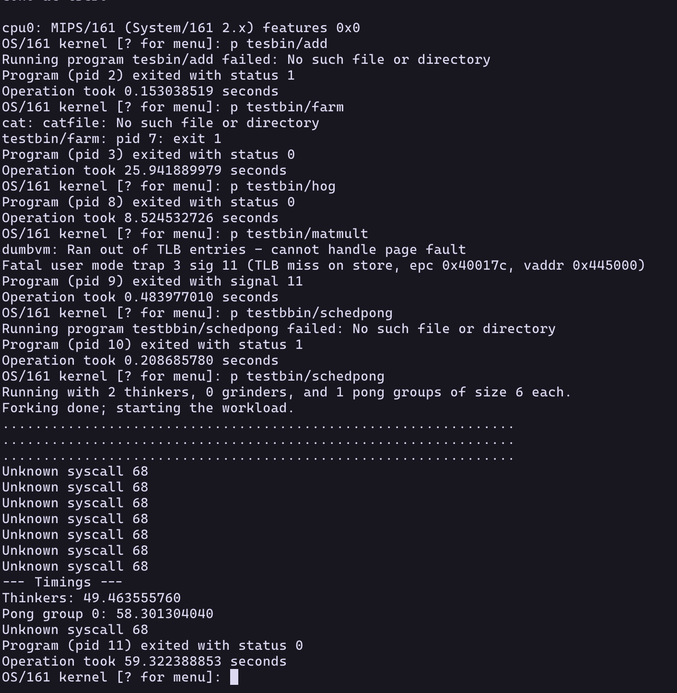
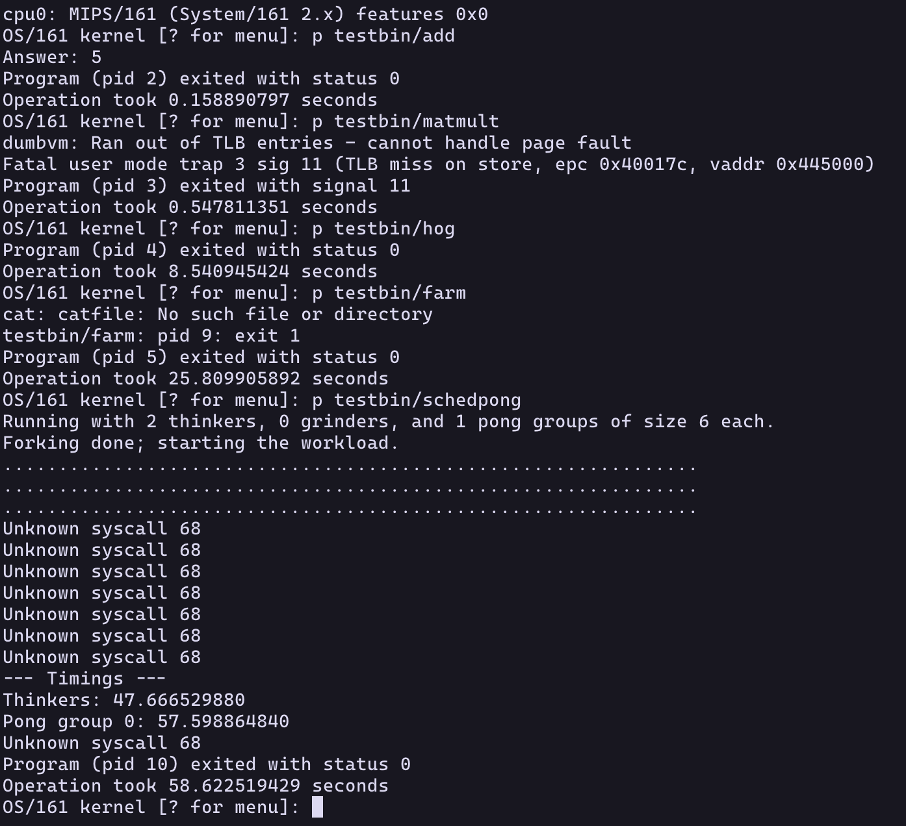

# os161SchedulerAssignBaseCode

## Design

### First-Come, First-Served (FCFS) Scheduling

#### Scheduler Explanation

The First-Come, First-Served (FCFS) scheduling algorithm is the simplest scheduling algorithm. It operates like a regular queue: processes are added to the ready queue in the order they arrive. When the CPU becomes free, the process at the front of the queue is dispatched and runs until it completes its CPU burst. Non-preemptive in nature, FCFS does not interrupt a running process even if a higher-priority process arrives later.

#### Performance Characteristics

**Better Performance:**

FCFS performs well under very specific and often limited conditions:

* **Long-running, CPU-bound jobs** 
* **Simple systems with minimal process interaction** 

**Worse Performance:**

FCFS often exhibits poor performance in many common scenarios:

* **Convoy Effect** 
* **Poor responsiveness for short jobs** 
* **Not suitable for time-sharing systems** 
* **Higher average waiting time** 

### Multi-Level Feedback Queue (MLFQ) Scheduling

#### Scheduler Explanation

Here's a general overview of how MLFQ works:

1.  **Multiple Queues:** There are several ready queues with different priority levels (e.g., Queue 1 has the highest priority, and Queue N has the lowest).
2.  **Initial Queue:** When a process arrives, it is typically placed in the highest-priority queue.
3.  **Time Quantum per Queue:** Each queue is assigned a specific time quantum. Higher-priority queues usually have smaller time quanta.
4.  **Scheduling within Queues:** Processes within each queue are scheduled using a specific algorithm (often Round Robin).
5.  **Process Demotion:** If a process uses up its entire time quantum in a given queue without completing its CPU burst, its priority is typically reduced, and it is moved to a lower-priority queue. This is based on the assumption that a process that uses its full time quantum is likely CPU-bound.
6.  **Process Promotion (Optional):** Some MLFQ implementations include rules for promoting processes to higher-priority queues. This might happen if a process has been waiting in a lower-priority queue for a long time, preventing starvation. Another common promotion rule is after a process completes an I/O operation, as this suggests it might become interactive.
7.  **Priority-Based Scheduling Across Queues:** The scheduler gives preference to processes in higher-priority queues. Only when all queues above a certain level are empty will the scheduler select a process from that level.

The specific number of queues, the scheduling algorithm within each queue, the time quantum for each queue, and the rules for demotion and promotion can vary significantly between different MLFQ implementations.

#### Performance Characteristics

**Better Performance:**

MLFQ is designed to offer improved performance in several scenarios:

* **Better responsiveness for interactive jobs** 
* **Good throughput for a mix of job types** 
* **Attempts to avoid starvation** 
* **Adaptability to process behavior** 

**Worse Performance:**

The performance of MLFQ can be negatively impacted by:

* **Complexity of configuration** 
* **Overhead of process migration** 
* **Potential for starvation** 
* **Unpredictable behavior for some applications** 

## Implementations

For the FCFS scheduler the only change that was made was at the end of the hardclock function the thread wont yield. Thus allowing it to finish.
For the MLFQ scheduler you had to change the thread struct to keep track of time, and to give it a priority. Then in the thread.c implementation 
you initialize three threadlist (queue) that will act as the MLFQ then you change hardclock so that it behaves like a MLFQ.

## Benchmark

Overall the test are inconclusive because os161 is a little iffy. and some of the test programs would crash, or wouldn't run for times long enough to be noticeable.

### FCFS Benchmark:

### FIFO Benchmark:

